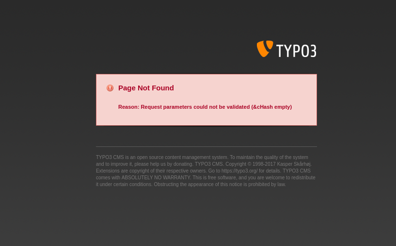
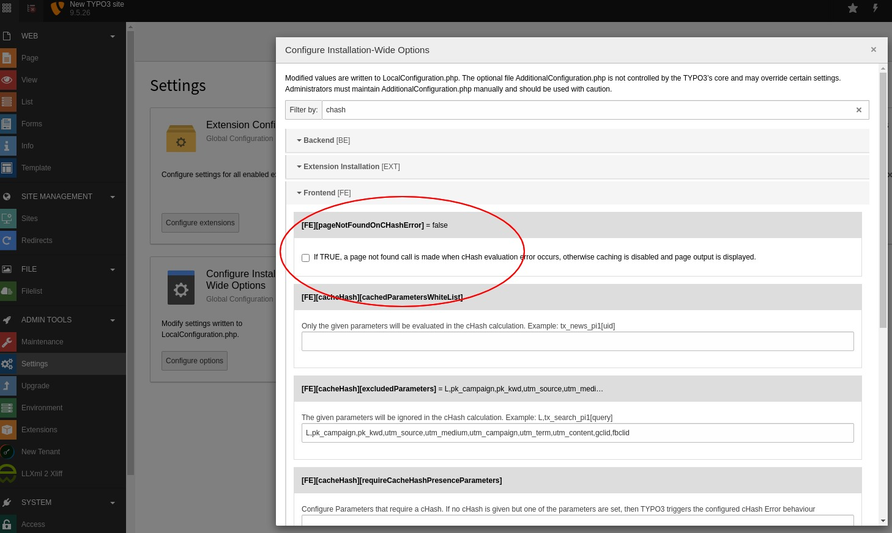

.. ==================================================
.. FOR YOUR INFORMATION
.. --------------------------------------------------
.. -*- coding: utf-8 -*- with BOM.

.. include:: ../Includes.txt

.. _system_setup:

############
System Setup
############

.. contents::
    :local:
    :depth: 2

**********
Web Server
**********

Content Security Policy
=======================

In case a Content Security Policy is set on the Kitodo.Presentation instance, make sure that ``blob:`` URLs are allowed as ``img-src``.
Otherwise, the page view may remain blank.

***********
TYPO3 Setup
***********

Extension Configuration
=======================

You should check the extension configuration!

* go to the Extension Configuration (:file:`ADMIN TOOLS -> Settings -> Extension Configuration`).
* open dlf
* check and save the configuration

Tenant Configuration
=======================

You must create a data folder for some Kitodo.Presentation configuration records like metadata,
structures, solrCore and formats (namespaces). This can be achieved easily with the 'New Tenant'
backend module on the left side in section 'Tools'.

Make sure, all fields are green. Then all necessary records are created.

TYPO3 Configuration
===================

Disable caching in certain situations
-------------------------------------

Navigation Plugin
~~~~~~~~~~~~~~~~~

The *navigation plugin* provides a page selection dropdown input field. The
resulting action url cannot contain a valid cHash value.

The default behaviour of TYPO3 is to call the pageNotFound handler and/or
to show an exception:

   TYPO3 Error-Message "Reason: Request parameters could not be validated (&cHash empty)"

This is not the desired behaviour. You should disable
:code:`$TYPO3_CONF_VARS['FE']['pageNotFoundOnCHashError'] = 0` to show the
requested page instead. The caching will be disabled in this case. This was
the default behaviour before TYPO3 6.x.

   TYPO3 Configuration of pageNotFoundOnCHashError in Settings Module

This configuration is written to *typo3conf/LocalConfiguration.php*::

    'FE' => [
            'pageNotFoundOnCHashError' => '0',
        ],

Avoid empty Workview
~~~~~~~~~~~~~~~~~~~~

You may notice from time to time, the viewer page stays empty even though you
pass the :code:`tx_dlf[id]` parameter.

This happens, if someone called the viewer page without any parameters or with parameters
without a valid cHash. In this case, TYPO3 saves the page to its cache. If you call the
viewer page again with any parameter and without a cHash, the cached page is
delivered.

With the search plugin or the searchInDocument tool this may disable the search functionality.

To avoid this, you must configure :code:`tx_dlf[id]` to require a cHash. Of
course this is impossible to achieve so the system will process the page uncached.

Add this setting to your *typo3conf/LocalConfiguration.php*::

    'FE' => [
        'cacheHash' => [
            'requireCacheHashPresenceParameters' => [
                'tx_dlf[id]',
            ],
        ],
    ]

Tip: Use the admin backend module: Settings -> Configure Installation-Wide Options

TypoScript Basic Configuration
------------------------------

Please include the Template "Basic Configuration (dlf)". This template adds
jQuery to your page by setting the following typoscript:

:typoscript:`page.includeJSlibs.jQuery`

Slug Configuration
------------------

With TYPO3 9.5 it is possible to make speaking urls with the builtin advanced
routing feature ("Slug"). This may be used for extensions too.

TYPO3 documentation about `Advanced Routing Configuration <https://docs.typo3.org/m/typo3/reference-coreapi/9.5/en-us/ApiOverview/Routing/AdvancedRoutingConfiguration.html>`_.

The following code is an example of an routeEnhancer for the workview page on uid=14.

.. code-block:: yaml
   :linenos:

   routeEnhancers:
     KitodoWorkview:
       type: Plugin
       namespace: tx_dlf
       limitToPages:
         - 14
       routePath: '/{id}/{page}'
       requirements:
         id: '(\d+)|(http.*xml)'
         page: \d+
     KitodoWorkviewDouble:
       type: Plugin
       namespace: tx_dlf
       limitToPages:
         - 14
       routePath: '/{id}/{page}/{double}'
       requirements:
         id: '(\d+)|(http.*xml)'
         page: \d+
         double: '[0-1]'

.. _configuration-solr:

*****************
Solr Installation
*****************

This extension doesn't include Solr, but just a prepared configuration set.
To setup Apache Solr, perform the following steps:

1. Make sure you have Apache Solr 8.11 and running.

   Download Solr from https://solr.apache.org/downloads.html.
   Other versions may work but are not tested.

2. Copy the config set to your solr home

.. code-block:: bash

      cp -r dlf/Configuration/ApacheSolr/configsets/dlf to $SOLR_HOME/configsets/

3. Get the Solr OCR Highlighting plugin and put it into contrib-directory.

   The plugin is available on GitHub: https://github.com/dbmdz/solr-ocrhighlighting/releases.
   The documentation can be found here: https://dbmdz.github.io/solr-ocrhighlighting/.

   The Solr OCR Highlighting plugin is required for full text search as of Kitodo.Presentation 3.3.

.. code-block:: bash

      cp solr-ocrhighlighting-0.7.1.jar to contrib/ocrsearch/lib/

4. Using basic authentication is optional but recommended.

   The documentation is available here:
   https://solr.apache.org/guide/8_8/basic-authentication-plugin.html

.. _configuration-typoscript:
