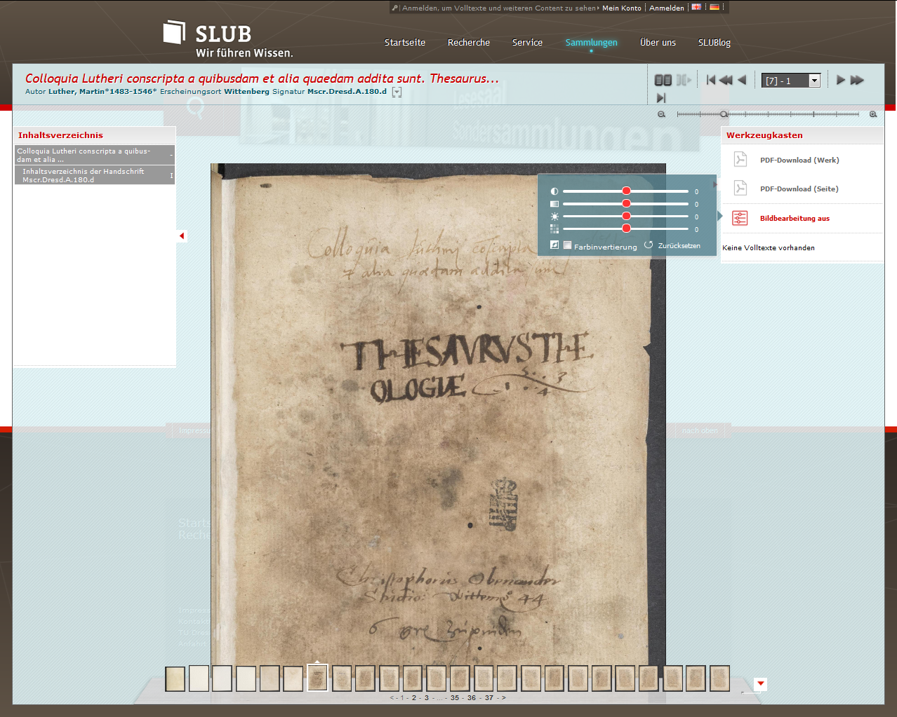
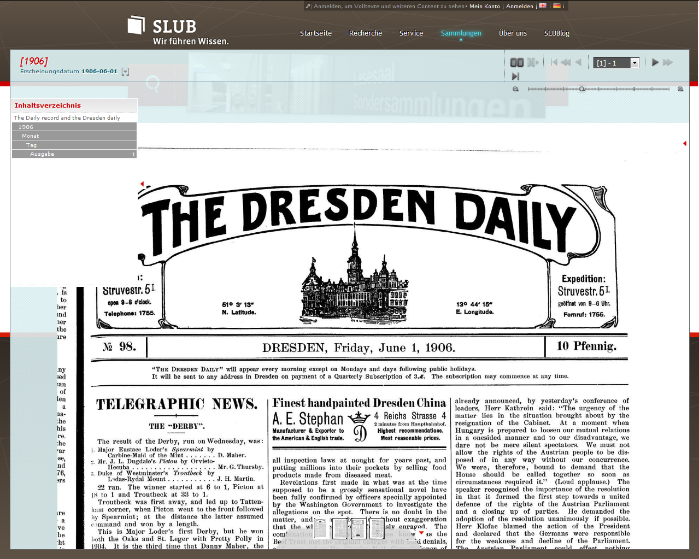
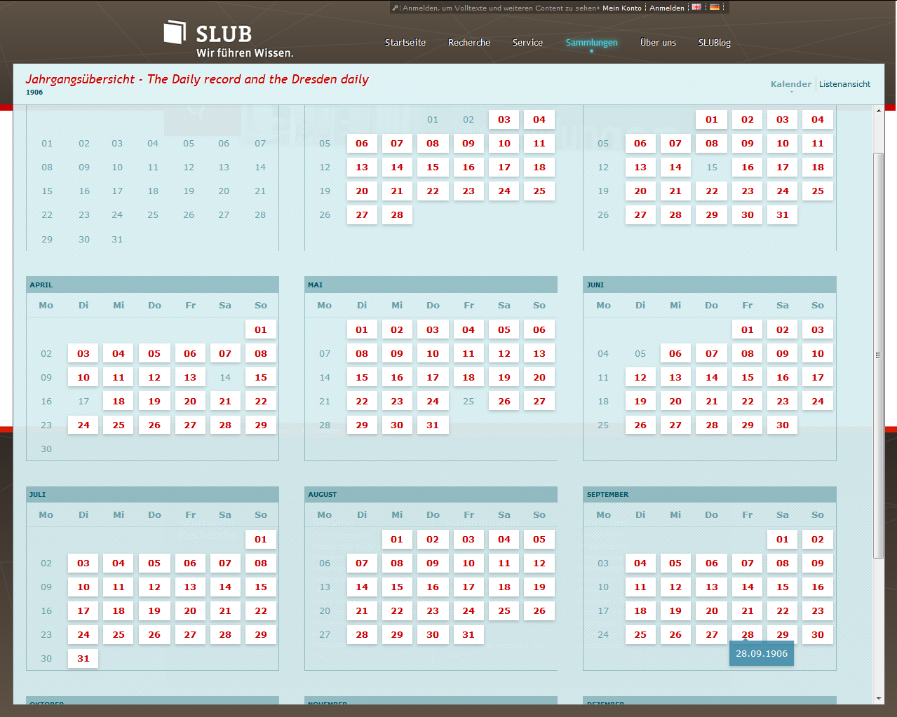

.. ==================================================
.. FOR YOUR INFORMATION
.. --------------------------------------------------
.. -*- coding: utf-8 -*- with BOM.

.. include:: ../Includes.txt

.. _introduction:

Introduction
============

.. _what-it-does:

About Kitodo.Presentation
-------------------------

Kitodo.Presentation is a powerful framework for building a METS-based digital
library. It is highly customizable through an user-friendly backend and flexible
design templates.

Since it is based on the great free and open source Content Management System
TYPO3, it can be integrated seamlessly into your website and can easily be
managed by editors.

Kitodo.Presentation provides a comprehensive toolset covering all basic
requirements for presenting digitized media: books, archivalia, digital
depositary copies, manuscripts and letters, prints, newspapers and magazines.

Download of current version is `avaiable on GitHub <https://github.com/kitodo/kitodo-presentation>`_.

Libraries using Kitodo.Presentation
-----------------------------------

Amongst others the following libraries are using Kitodo.Presentation for their digital collections:

* `SLUB Dresden <http://digital.slub-dresden.de/>`_
* `UB "Georgius Agricola" at the TU Bergakademie Freiberg <http://digital.ub.tu-freiberg.de/>`_
* `SUB Hamburg <http://digitalisate.sub.uni-hamburg.de/>`_
* `Gottfried Wilhelm Leibniz Library Hannover <http://digitale-sammlungen.gwlb.de/>`_
* `UB Mannheim <https://digi.bib.uni-mannheim.de/>`_
* `Orff-Zentrum München <http://www.orff-zentrum.de/>`_
* `Württembergische Landesbibliothek Stuttgart <http://digital.wlb-stuttgart.de/digitale-sammlungen/>`_

In Kitodo.Presentation, the METS/MODS formats are flexible. Digital collections
can be configured for any METS-based format, e.g. METS/TEI for manuscripts.

Unrestricted access to TYPO3 functions, such as user authentication, session
handling, language localization, caching, etc., is possible within the
Kitodo.Presentation functional modules. The entire system is multi-client
capable, i.e. any number of instances of Kitodo.Presentation can be run within
a single TYPO3 installation, each with its own configuration, search index,
backend pages, access permissions, visual design, etc.

Kitodo.Presentation offers a standard OAI-PMH2-compliant interface for
international search capability and digital metadata legibility. We recommend
registering your Kitodo installation with the appropriate public OAI registry.

Software Components
-------------------

The software primarily consists of three modules:

Commons
^^^^^^^
is a group of classes that build upon the TYPO3 API, adding
Kitodo-specific functions, such as handling METS structures and library metadata
in various formats, or linking external resources, such as OAI-PMH interfaces or
Solr search engines. The API extensions are available to all TYPO3 extensions,
which means that they can be used not only by Kitodo.Presentation, but by other
extensions as well. Thus, commercial or other very specific functions, which
are only necessary in single installations, don't need to be part of the official
Kitodo.Presentation release, but can be created as separate extensions.

Modules
^^^^^^^
is a group of components that are integrated into the TYPO3 backend and
manage the configuration of extensions as well as of digital resources, clients
and collections. Currently, there is a module for client management as well as
integrations with the basic TYPO3 list module to manage the digital resources.
In addition, they enable a highly granular configuration of structure and
metadata handling as well as database management. Furthermore, a command line
interface is provided, which allows automation of procedures, such as importing
digital resources.

Plugins
^^^^^^^
are components that build the frontend output and provide various functions.
All plugins can be precisely configured via GUI and freely dropped into
TYPO3-managed web pages. All frontend outputs are based on design
templates and are thus fully customizable.

.. _screenshots:

Screenshots
-----------

Some examples of Kitodo.Presentation in action on the `digital collection of SLUB Dresden <http://digital.slub-dresden.de/>`_:

   Mscr.Dresd.A.180.d

   Find this document in `SLUB digital collections. <http://digital.slub-dresden.de/werkansicht/dlf/162147/7/>`__

   Newspaper an Other Periodicals

   Find this document in `SLUB digital collections. <http://digital.slub-dresden.de/werkansicht/dlf/120620/1/>`__

   Calendar for Digitised Newspapers

   Find this document in `SLUB digital collections. <http://digital.slub-dresden.de/werkansicht/dlf/120676/1/>`__

.. figure:: ../Images/Introduction/KitodoPresentation-SLUB-Volltexte.PNG
   :width: 500px
   :alt: Full Text and OCR Presentation

   Full Text and OCR Presentation

   Find this document in `SLUB digital collections. <http://digital.slub-dresden.de/werkansicht/dlf/120676/1/>`_
