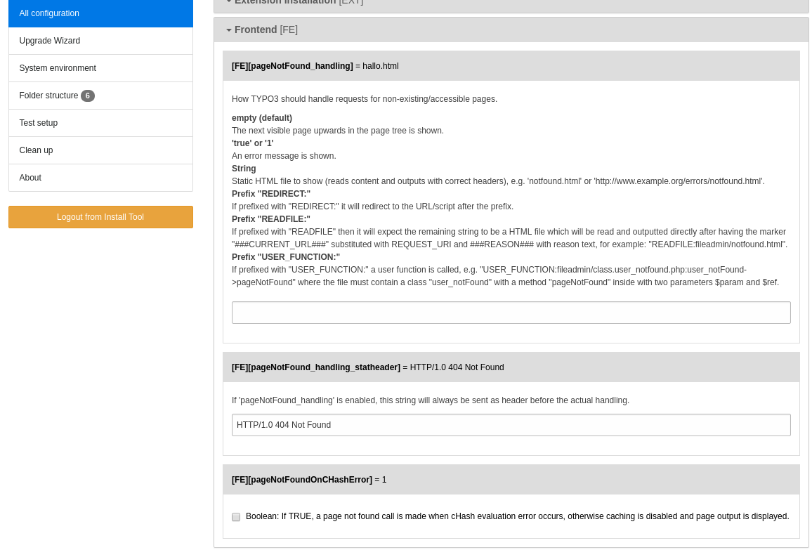

.. ==================================================
.. FOR YOUR INFORMATION
.. --------------------------------------------------
.. -*- coding: utf-8 -*- with BOM.

.. include:: ../Includes.txt

.. _system_setup:

============
System Setup
============

.. contents::
	:local:
	:depth: 2

***********
TYPO3 Setup
***********

The navigation plugin provides a page selection dropdown input field. The
resulting action url cannot contain a valid cHash value.

The default behaviour of TYPO3 is to call the pageNotFound handler and/or to show an exception:

.. figure:: ../Images/Configuration/typo3_pagenotfoundonchasherror.png
   :width: 800px
   :alt: TYPO3 Error-Message "Reason: Request parameters could not be validated (&cHash empty)"

   TYPO3 Error-Message "Reason: Request parameters could not be validated (&cHash empty)"

This is not the desired behaviour. You should configure in the TYPO3 install tool
$TYPO3_CONF_VARS['FE'][pageNotFoundOnCHashError]=0 to show the requested page
instead. The caching will be disabled in this case. This was the default
behaviour before TYPO3 6.x.

   TYPO3 Configuration of pageNotFoundOnCHashError in Install Tool

The install tool writes this configuration to typo3conf/LocalConfiguration.php::

	'FE' => [
	        'pageNotFoundOnCHashError' => '0',
	        'pageNotFound_handling' => '',
	    ],

.. _configuration-solr:

*****************
SOLR Installation
*****************

The following instructions are taken from `dlf/lib/ApacheSolr/README.txt`.

Apache Solr for Kitodo.Presentation
==================================

This is just a pre-configured version of Apache Solr. Some files have to be
patched in order to add some configuration and security constraints for up
to 15 different Lucene cores to be used by Kitodo.Presentation. If you need
more cores, you have to add more security constraints by yourself.
Additionally there are ready-to-use configuration files for the Apache Solr
application in the conf/ directoy.

Installation instructions
-------------------------

See also: https://wiki.apache.org/solr/SolrTomcat

1. Make sure you have Apache Tomcat 6 up and running. Download Solr 3.6.1
	from http://lucene.apache.org/solr/. Other versions up until Solr 5.0 might be possible but are not tested.

	As of Solr 5.0, Solr is no longer distributed as a "war" and has to be deployed as a standalone java server application.

2. Apply the patches in patches/* to the respective files and build Solr.

3. Create a working directory for your Solr installation ($SOLR_HOME)

4. Copy the solr.xml and conf/* to $SOLR_HOME. Move the compiled Solr WAR file to $SOLR_HOME as well.

5. Adjust $SOLR_HOME and the name of your .war in conf/solr.xml accordingly.
	Defaults are `$SOLR_HOME = home/solr` and `apache-solr-for-kitodo.war`

6. Add the roles "dlfSolrUpdate" and "dlfSolrAdmin" and at least one user
	with both roles to Tomcat's tomcat-users.xml file.

7. Symlink or place the file conf/solr.xml in $CATALINA_HOME/conf/Catalina/localhost/.

8. Restart Tomcat and the Solr installation should be available at http://localhost:8080/solr

Update instructions
-------------------

When updating an existing Solr instance for Kitodo.Presentation follow the
above steps but DO NOT overwrite solr.xml! Kitodo.Presentation dynamically
adds new cores to this file, so overwriting it would result in a loss of
these indexes.

.. _configuration-typoscript:

******************************
TypoScript Basic Configuration
******************************

Please include the Template "Basic Configuration (dlf)". This template adds
jQuery 2.2.1 to your page by setting the following typoscript:

:typoscript:`page.includeJSlibs.jQuery`
